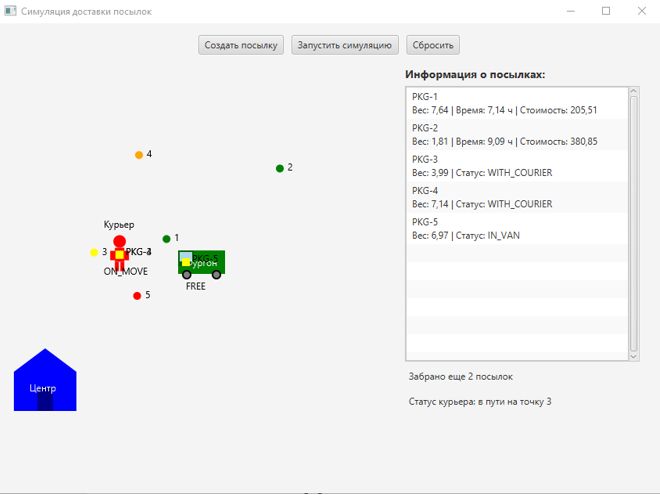
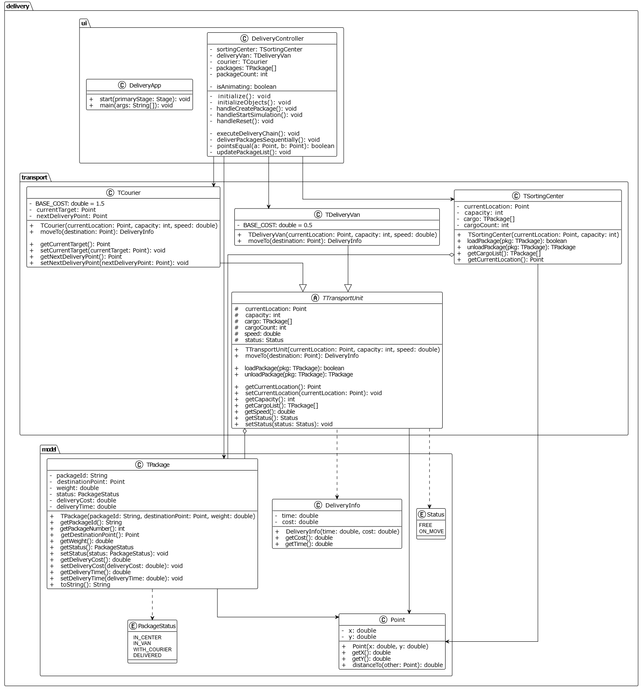

# Симуляция доставки посылок (Delivery Simulation)

----------------

**Описание**: Визуальная симуляция цепочки доставки посылок: сортировочный центр → грузовой фургон → курьер → пункт назначения. 

Проект помогает:
- Понять логику многоступенчатой доставки (центр → фургон → курьер → пункт назначения)
- Отслеживать статусы посылок и транспортных единиц
- Сравнивать время и стоимость доставки при разных параметрах

- **Технологический стек**: Java 11, JavaFX 17, Maven. Standalone desktop-приложение с FXML-интерфейсом.
- **Статус**: Beta. Основная функциональность реализована.
- **Ссылка на продукт или демо-экземпляр**: Локальный запуск через Maven (см. раздел «Установка»).
- **Отличие от типовых логистических систем:** Анимация перемещения объектов, расчёт времени и стоимости в реальном времени, визуализация на Canvas.

**Скриншот рабочего окна приложения**: 

## Архитектура

Диаграмма классов модели:

**Пакеты**:
- `delivery.model` — модели данных: посылка (TPackage), точка (Point), статусы (PackageStatus, Status), информация о доставке (DeliveryInfo)
- `delivery.transport` — транспортные единицы: абстрактный TTransportUnit, TSortingCenter, TDeliveryVan, TCourier
- `delivery.ui` — интерфейс: главный класс приложения (DeliveryApp), контроллер (DeliveryController)

## Зависимости

- **Java**: JDK 11 или выше
- **Maven**: 3.6+
- **JavaFX**: 17.0.2 (подключается через Maven)

## Установка

1. Клонируйте репозиторий
2. Убедитесь, что установлены Java 11+ и Maven
3. Соберите проект: `mvn clean compile`
4. Запустите: `mvn javafx:run`

## Конфигурация

Конфигурация не требуется. Параметры (вместимость, скорость, базовые стоимости) заданы в коде и могут быть изменены в соответствующих классах.

## Применение

1. **Создать посылку** — создаёт посылку со случайным пунктом назначения и весом, размещает её в сортировочном центре
2. **Запустить симуляцию** — фургон забирает посылки из центра, едет к точке передачи, курьер забирает посылки и доставляет их по адресам
3. **Сбросить** — очищает сцену и сбрасывает все объекты в начальное состояние

## Проверка ПО

Автоматизированные тесты в проекте не предусмотрены. Проверка выполняется ручным запуском и проверкой сценариев через UI.

## Проблемы

- Нет сохранения состояния между сессиями
- Нет базы данных; все данные хранятся в памяти

## Получение справочной информации

При возникновении вопросов или ошибок создайте Issue в репозитории проекта.

## Приглашение к сотрудничеству

Предлагаемые направления развития:
- Добавление unit-тестов
- Сохранение и загрузка сценариев
- Настройка параметров через конфигурационный файл

----

## Источники и справочники
1. JavaFX Documentation — https://openjfx.io/
2. Maven — https://maven.apache.org/
3. Учебные материалы курса по ООП
